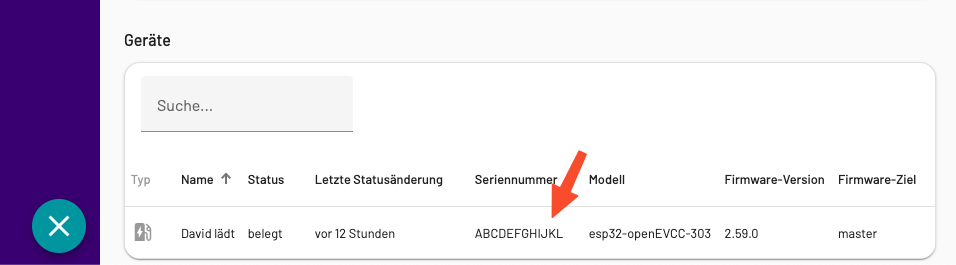

# homeassistant-pulsatrix-local-mqtt

This is a custom component for Home Assistant to integrate the pulsatrix charger (v3) using the MQTT API (v2).

## Installation

### Prerequisites

- install an MQTT Broker (preferrably Mosquitto). Either via "Addons" (if you use Home Assitant OS) or manually on your OS
- contact [pulsatrix support](mailto:support@pulsatrix.de) and ask them to link the devices to the MQTT Broker
- they will ask you for the IP/Hostname of the MQTT Broker within the current network as it needs to be reachable from the charging controller
- in Home Assistant add the MQTT Integration and configure it to the freshly installed MQTT Broker

### HACS

Use HACS to install this custom component.

### Manual

- Clone the repo
- copy the folder custom_components/pulsatrix_local_mqtt to your custom_components folder
- restart Home Assistant

## Configuration

Use the Web UI (Config flow) to add the "pulsatrix" integration. You have to know the `serial number` (12 digits) of your device. 

## Entities

| Friendly name       | Category     | Type          | Enabled per default  | Description                             |
|---------------------|--------------|---------------|----------------------|-----------------------------------------|
| Charging            | `diagnostic` | binary sensor | :heavy_check_mark:   | Weather the EV is charging or not       |
| Current Consumption | `diagnostic` | sensor        | :heavy_check_mark:   | The consumption in kW                   |
| State               | `diagnostic` | sensor        | :heavy_check_mark:   | The state of the controller (see below) |
| Frequency           | `diagnostic` | sensor        | :white_large_square: | The grid frequency                      |
| P1 voltage          | `diagnostic` | sensor        | :white_large_square: | Phase 1 voltage                         |
| P2 voltage          | `diagnostic` | sensor        | :white_large_square: | Phase 2 voltage                         |
| P3 voltage          | `diagnostic` | sensor        | :white_large_square: | Phase 3 voltage                         |
| P1 amperage         | `diagnostic` | sensor        | :white_large_square: | Phase 1 amperage                        |
| P2 amperage         | `diagnostic` | sensor        | :white_large_square: | Phase 2 amperage                        |
| P3 amperage         | `diagnostic` | sensor        | :white_large_square: | Phase 3 amperage                        |

`diagnostic`: An entity exposing some configuration parameter or diagnostics of a device

`config`: An entity which allows changing the configuration of a device

### States

The sensor state can have the following states

| Value                           | Friendly name                                                                                     | Raw Value              |
|---------------------------------|---------------------------------------------------------------------------------------------------|------------------------|
| Idle                            | No transaction in progress                                                                        | IDLE                   |
| Awaiting Start                  | Transaction is currently blocked from starting                                                    | AWAITING_START         |
| Awaiting Authorization          | Transaction is awaiting authorization by some means                                               | AWAITING_AUTHORIZATION |
| Starting                        | Transaction is currently starting (transitional state)                                            | STARTING               |
| Not offering charging           | Vehicle is connected but not offered any charging current                                         | SUSPENDED_EVSE         |
| Offered charging but not taking | Vehicle is connected, offered charging but not taking any                                         | SUSPENDED_EV           |
| Charging                        | Electrical energy is being transferred                                                            | CHARGING               |
| Failed                          | Charging has failed, but the vehicle is still connected                                           | FAILED                 |
| Stopped externally              | The transaction has been stopped by external means                                                | STOPPED                |
| Wait for EV to reconnect        | The transaction is about to end, but lingering to give the user a chance to reconnect the vehicle | LINGERING              |
| Completed                       | The transaction has irrevocably ended and is considered completed                                 | COMPLETE               |